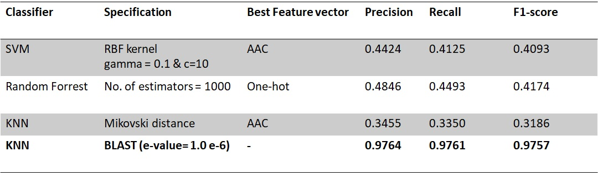
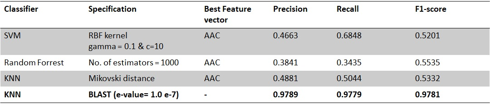
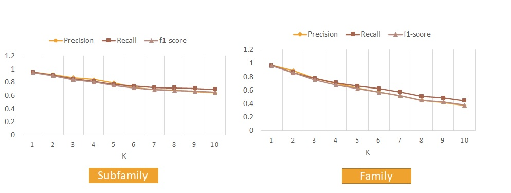
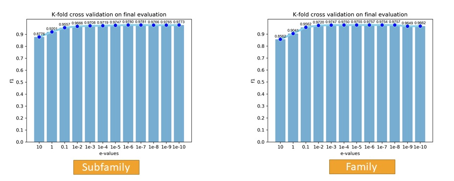

# BigDataProject
ABSTRACT

According to rapid improvements in genome sequencing, protein functional annotation is turned into the focus of interest in many academic efforts. In this project, we analyze the Transporter Classification Database (TCDB). The TCDB is a comprehensive database for membrane transport proteins, which is approved by the International Union of Biochemistry and Molecular Biology (IUBMB), known as the Transporter Classification (TC) system. The main goal of this analysis is to classify membrane transport proteins into families with the same functionality. Supposing sequences with similar features might have similar functionalities, classifying protein sequences based on their features could be a practical method for protein functional annotation.

INTRODUCTION

Although the sequences of many membrane proteins are available now, their specific functions remain unknown. Therefore, there is a consistent need for computational methods that predict the function of membrane proteins. Supposing sequences with similar features might have similar functionalities, classifying protein sequences based on their features could be a practical method for protein functional annotation. In this research, given a transporter protein amino acid sequence, a prediction of its TC family and superfamily is to be made.
Transporter proteins is a term used for addressing proteins that serve the function of moving different substances across the cell. These are traffic gates that organize a variety of vital cellular functions including cell signaling, trafficking, metabolism, and energy production[1]. Generally, finding the functions of each protein with experimental methods is not an easy task, because the function may be related specifically to the native environment in which a particular organism lives; such an environment is hard to simulate in a lab.  In this research, we use different methods to classify transfer protein sequences on the TCDB database based on their TC families and superfamilies. 
The TC system is a classified transporters dataset, analogous to the Enzyme Commission (EC) system for classification of enzymes, except that it incorporates both functional and phylogenetic information. Sequences in the TCDB database are organized in a five-level hierarchical system as follows: N1.L1.N2.N3.N4. Transporters are classified based on five criteria, and each of these criteria corresponds to one of the five numbers or letters within the TC number for a particular type of transporter. Here we classify the protein sequences based on N2 and N3. N2 represents the transporter superfamilies of which there are over 1000 in TCDB and N3 represents the family or phylogenetic clusters within a family.

MATERIALS AND METHODS
1.	Preprocessing:
Preprocessing includes 3 major steps: First, excluding sequences with unacceptable amino acids (B, Z, X, J, O, U ). Then, excluding sequences with unacceptable length (length > 1000 or < 50). Third step is extracting a balanced dataset which is explained on the following section. 

2.	DATASET
In this research, we analyze the Transporter Classification Database (TCDB ). TCBD contains more than 10,000 non-redundant transporter proteins. After preprocessing the data, we extracted two different datasets using down-sampling. We extract 30 sequences of each family/subfamily randomly based on central limit theorem. Consequently, families and subfamilies with less than 30 sequences are excluded. First dataset, family, includes 2880 samples (30 samples from 96 families) and second dataset, subfamily, includes 1500 samples (30 samples from 50 subfamilies).

3.	 FEATURE EXTRACTION
In this project, several features are explored: Amino Acid Composition (AAC), pair amino acid composition (PAAC), and resampled one-hot feature vector. The Amino Acid Composition or AAC is the number of amino acids of each type normalized with the total number of residues. PAAC is the normalized frequency of each pair of amino acids. And the third feature vector is the resampled one-hot encoding feature vector. First, one-hot encoding creates a binary column for each category and returns a sparse matrix or dense array. As a result, each amino acid chain is mapped to a binary string. Then, “scipy.signal” package is used to sample from each sparse binary strings. We set a maximum sample length to 100.
In addition to positional and combinational features, evolutional features might be useful in classifying transporter protein sequences. The alignment of protein sequences reveals practical evolutional information of protein sequences. BLAST or Basic Local Alignment Search Tool algorithm is a local sequence alignment method designed for protein sequence alignments. This algorithm takes a query protein sequence as input, and searches the sequence databases for similarities[3]. Protein similarities could be used in predicting the families and subfamilies of each sequence.   

4.	 CLASSIFICATION
In this project, we implemented 4 different classifiers with different configurations. 
   •	Support Vector Machines or SVM with multiple kernels (linear, RBF, multinomial)
   •	Random Forrest with various number of estimators (from 100 to 1500 with step of 100)
   •	K-Nearest Neighbor with different numbers of K
   •	and K-Nearest Neighbor using BLAST
 The datasets are split to test and train segments with the proportion of 0.2 and 0.8 respectively. 5-folds cross-validation is implemented to assist with more accurate results. 

RESULTS:

REFERENCES:

[1] Chang, A. B., Lin, R., Studley, W. K., Tran, C. V., & Saier, Jr, M. H. (2004). Phylogeny as a guide to structure and function of membrane transport proteins. Molecular membrane biology, 21(3), 171-181.

[2] Saier Jr, M. H., Tran, C. V., & Barabote, R. D. (2006). TCDB: the Transporter Classification Database for membrane transport protein analyses and information. Nucleic acids research, 34(suppl_1), D181-D186.

[3] Altschul, S. F., Gish, W., Miller, W., Myers, E. W., & Lipman, D. J. (1990). Basic local alignment search tool. Journal of molecular biology, 215(3), 403-410.

